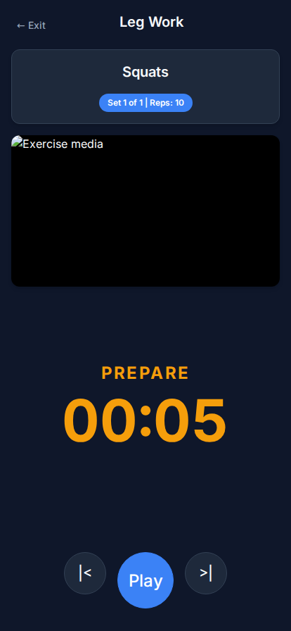

# Interval Timer App

A comprehensive, modern interval timer application tailored for physical therapy and workouts. This application allows you to create detailed workout plans consisting of multiple exercises with configurable work and rest intervals.



## Features

- **Modern Mobile-First UI**: Dark-themed, responsive design that looks great on mobile and desktop.
- **Custom Workout Plans**: Create and manage multiple physical therapy/workout plans.
- **Detailed Exercises**: Configure name, description, sets, reps, work time, and rest time for each exercise.
- **Media Integration**:
  - Automatically fetch default thumbnails for YouTube links.
  - View rotating images or YouTube videos in the media container during workouts.
  - Automatically pause other media.
- **Text-To-Speech (TTS) Prompts**: Uses the Web Speech API to provide audio cues (e.g., "3-2-1 Go", "Rest", and exercise announcements).
- **Backend YAML Storage**: Plan data is persisted into a local YAML file (`data/plans.yml`) instead of just local storage.

## How to Run with Docker Compose

To run the application easily via Docker without needing to install Node.js locally:

1. Clone the repository.
2. Ensure you have Docker and Docker Compose installed.
3. Start the application:
   ```bash
   docker-compose up -d
   ```
4. Access the app in your browser at `http://localhost:8080`.

### Data Volume Mounting

By default, the `docker-compose.yml` mounts a local `./data` directory into the container at `/app/data`. This allows you to:
- Retain your saved workouts even if the container is destroyed.
- Manually edit or backup the `plans.yml` file from your local machine.

## Local Development (Node.js)

If you prefer to run the app via Node.js:

1. Install dependencies:
   ```bash
   npm install
   ```
2. Start the server:
   ```bash
   npm start
   ```
3. Open `http://localhost:80` (or whichever port is assigned via the `PORT` env var).